# Relatório sobre execução da Atividade Prática 01

**Aluno:** André Felipe de Oliveira Lopes

---

> **OBS.:** estes arquivos podem ser encontrados [aqui](https://github.com/andref03/Processamento-Digital-Imagens-PDI/tree/main)

## Questão 01

Nesta questão, eu me baseei no [Google Colab](https://colab.research.google.com/drive/1b7xJ_FxxSxpQpU6dquqdcWcBwjqmEwkv#scrollTo=5c389609) disponibilizado na sala de aula.

Primeiramente, eu fiz a instalação do ```numpy matplotlib```, e importei ambos.

``` python
%pip install numpy matplotlib
import numpy as np
import matplotlib.pyplot as plt
%matplotlib inline
```

Na **letra A**, o objetivo era criar uma máscara branca em cima de um quadrado preto 200x200 px. Inicialmente criei o quadrado preto de lado 200 px. multiplicando a matriz de ones por 0, para aplicar a cor preta.

``` python
# imagem 200x200, pixels pretos (0)
imagem_preta = np.ones((200, 200), dtype=np.uint8) * 0

imagem_preta[50:150, 50:150] = 255

plt.imshow(imagem_preta, cmap='gray', vmin=0, vmax=255)
plt.title('Imagem Preta com Quadrado Branco (Escala de Cinza)')
plt.show()
```

Depois, foi só criar uma máscara ```imagem_preta[50:150, 50:150] = 255```, que é igual a 255 porque possui a máxima intensidade (coloração branca).

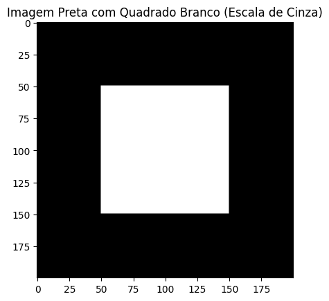

Na **letra B**, gerei a imagem a partir da matriz de zeros (preta) no tamanho 200x200 px. Pra conseguir representar os níveis de intensidade do cinza, usei a função linspace, do np, o que fez a variação de cores acontecer (isso é basicamente o degradê). E o reshape usei para transformar o vetor do linspace em uma linha só. Pra aplicar essa linha na imagem inteira, usei o repeat com parâmetro 200.

``` python
# imagem 200x200
imagem_degrade = np.zeros((200, 200), dtype=np.uint8)

# gradiente horizontal
imagem_degrade = np.linspace(0, 255, 200, dtype=np.uint8).reshape(1,  200) 

# repete o gradiente para preencher a imagem
imagem_degrade = np.repeat(imagem_degrade, 200, axis=0)

plt.imshow(imagem_degrade, cmap='gray')
plt.title('Imagem com Gradiente')
plt.show()
```

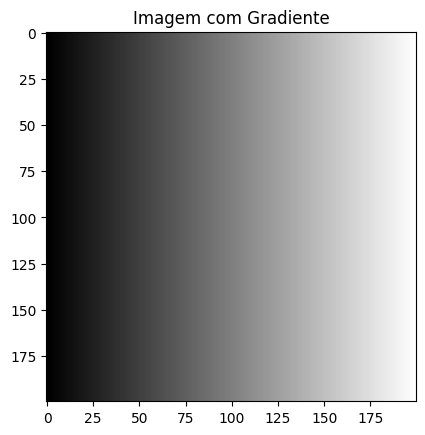

Na **letra C**, usei a função do np where(), colocando primeiro a condição: onde houver pixels 0 (pretos) na imagem_preta. Se verdadeiro, então mantem a imagem_preta. Se false, então usa-se a imagem_degrade.

``` python
# se imagem_preta for 0, mantém imagem_preta. senão, usa o valor de imagem_degrade
imagem_mesclada = np.where(imagem_preta == 0, imagem_preta, imagem_degrade)

plt.imshow(imagem_mesclada, cmap='gray')
plt.title('Imagem Mesclada (Quadrado Branco + Gradiente)')
plt.show()
```

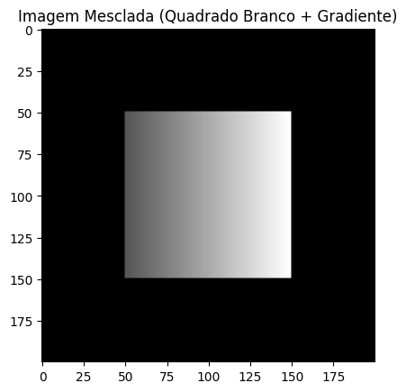

---

## Questão 02

Na **letra A**, apenas importei a imagem do diretório atual, com função do plt.imread, e depois imprimi na tela (saída) a imagem para verificar se estava ok.

```python
img_q2_a = plt.imread('q2_a_original.png', format='png')

plt.imshow(img_q2_a, cmap='gray')
plt.title('Imagem Q2-A (Original)')
plt.show()
```

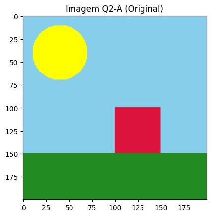

Na **letra B**, usei a imagem original como base e inverti a ordem das suas cores primárias de [0,1,2] para [2,1,0]. Ou seja: de RGB para BGR.

``` python
# convertendo de RGB para BGR
img_q2_a_BGR = img_q2_a[:, :, [2,1,0]]

plt.imshow(img_q2_a_BGR)
plt.title('Imagem Q2-A (BGR)')
plt.show()
```

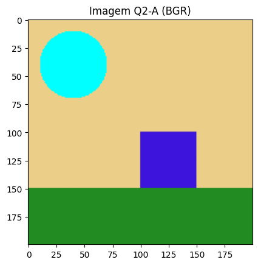

Na **letra c**, basicamente zerei as cores primárias verde ([..., 1]) e azul ([..., 2]). Dessa forma, prevaleceu só a cor primária vermelha ([..., 0]), que serviu de filtro e "refletiu" somente as tonalidades de vermelho presentes na imagem.

``` python
img_q2_a_red = img_q2_a.copy()

img_q2_a_red[..., 1] = 0  # canal verde
img_q2_a_red[..., 2] = 0  # canal azul

plt.imshow(img_q2_a_red)
plt.title('Imagem Q2-A (Filtro Vermelho Forte)')
plt.show()
```

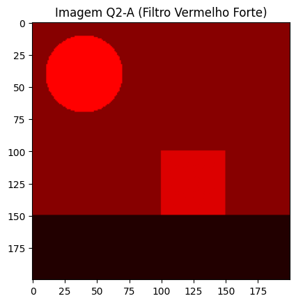

---

## Questão 03

Na **letra A**, com uso da função da média pelo np (np.mean) em cima da imagem original, o que resulta em um único valor de intensidade. A imagem ficou acinzentada porque essa função da média retirou a informação das cores, mantendo somente a intensidade de cada pixel mesmo.

``` python
# convertendo para escala de cinza usando a média dos canais
img_cinza = (np.mean(img_q2_a, axis=2) * 255).astype(np.uint8)

plt.imshow(img_cinza, cmap='gray')
plt.title('Imagem Q2-A (Média dos Canais - Escala de Cinza)')
plt.show()
```

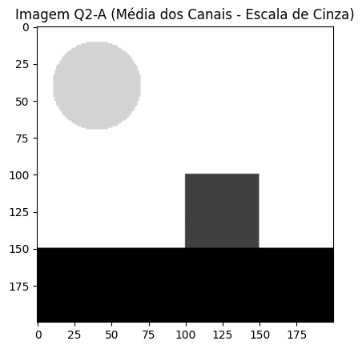

Na **letra B**, usei de novo a função da média, que retornou o valor da intensidade média global da imagem. Pra ver a distribuição dos níveis de cinza, criei o histograma solicitado, mostrando a distribuição dos pixels.

``` python
# cálculo da média geral de todos os pixels
media_geral = np.mean(img_cinza)
print(f'Média geral dos pixels: {media_geral}')

# histograma com 255 bins
plt.figure(figsize=(10, 6))
plt.hist(img_cinza.flatten(), bins=255, color='gray', edgecolor='black')
plt.title(f'Histograma\nMédia: {media_geral:.2f}')
plt.show()
```

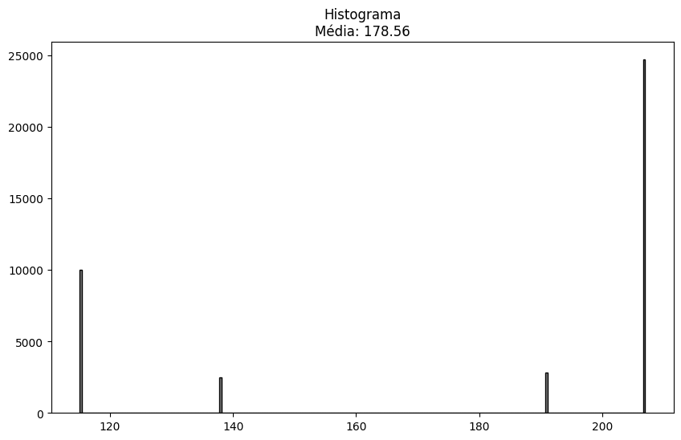

Na **letra C**, usei o valor da média como limiar, com ajuda da função where novamente. Ou seja: se os pixels (a partir da imagem cinza desta quetsão) forem maiores ou iguais ao limiar, então seriam convertidos para branco (255). Se forem menores do que o limiar, então seriam convertidos para preto (0).

``` python
# usando a média como limiar
threshold = media_geral

# criando a imagem binária (máscara)
img_limiarizada = np.where(img_cinza >= threshold, 255, 0).astype(np.uint8)

# exibindo resultado
plt.imshow(img_limiarizada, cmap='gray')
plt.title(f'Limiarização (Threshold = {threshold:.2f})')
plt.show()
```

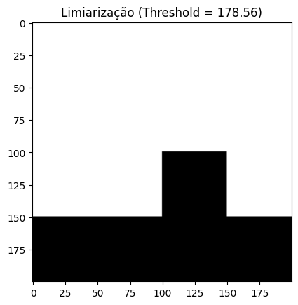

---

## Questão 04

Na **letra A**, o objetivo era fazer uma máscara para o fundo (nesse caso da imagem, seria o céu). Usei uma linha para verificar qual é a intensidade da cor do céu, ou seja, o código RGB dele, para usar na máscara. Essa máscara é feita usando a sugestão do comando da questão, que era sobre usar lógica booleana com o operador &. Assim, foi só aplicar a máscara, com os valores encontrados dos pixels do céu, em cima da imagem original. No fim, o céu ficou "isolado" mesmo.

``` python
print(img_q2_a[10, 10])  # pega um ponto do céu

# valores de R, G, B do céu (normalizados entre 0 e 1)
R_ref = 0.5294118
G_ref = 0.80784315
B_ref = 0.92156863

# criando máscara booleana do fundo
mascara_fundo = (
    (np.abs(img_q2_a[:, :, 0] - R_ref) <= 0.05) &
    (np.abs(img_q2_a[:, :, 1] - G_ref) <= 0.05) &
    (np.abs(img_q2_a[:, :, 2] - B_ref) <= 0.05)
)

plt.imshow(mascara_fundo, cmap='gray')
plt.title('Máscara do Fundo')
plt.show()
```

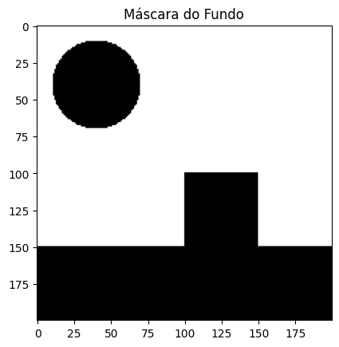

Na **letra B**, eu basicamente repliquei a lógica de importação da imagem presente na questão 2A. Claro que dessa vez mudando o nome do arquivo de origem.

``` python
novo_fundo = plt.imread('q4_b_fundo.png', format='png')

plt.imshow(novo_fundo, cmap='gray')
plt.title('Novo fundo para céu')
plt.show()
```

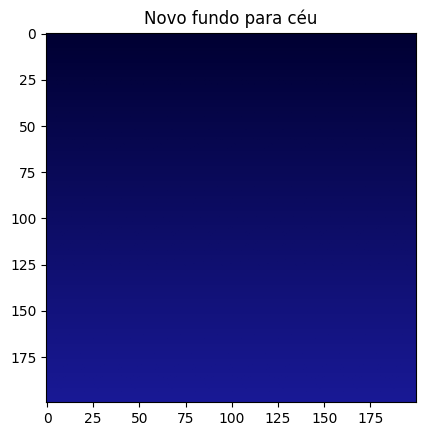

Na **letra C**, apliquei uma lógica de Chroma Key. Criei uma cópia da imagem original, da questão 2, e utilizei a indexação booleana do np pra substituir os pixels da imagem original pelos pixels advindos da nova imagem carregada, que é o novo fundo (obtido na questão 4B). Como a máscara era somente do céu, então somente eles foram substituídos.


``` python
# garantir que o fundo novo tem o mesmo tamanho
novo_fundo = novo_fundo[:, :, :3]
img_original = img_q2_a[:, :, :3]

# cópia da imagem original
imagem_final = img_original.copy()

# aplicação do chroma key
imagem_final[mascara_fundo] = novo_fundo[mascara_fundo]

# exibir resultado
plt.imshow(imagem_final)
plt.title('Chroma Key - Fundo Substituído')
plt.show()
```

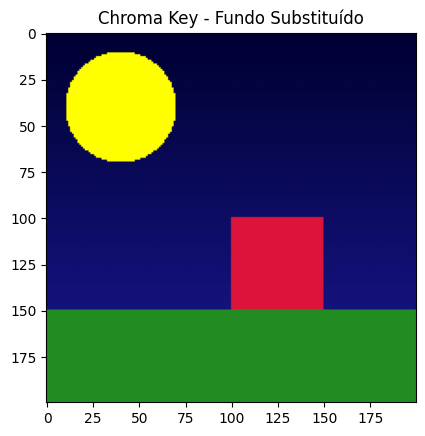